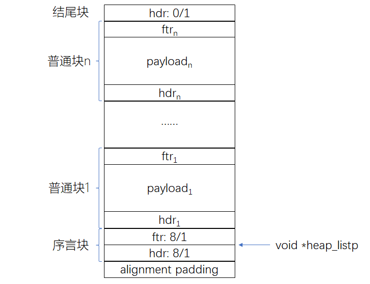
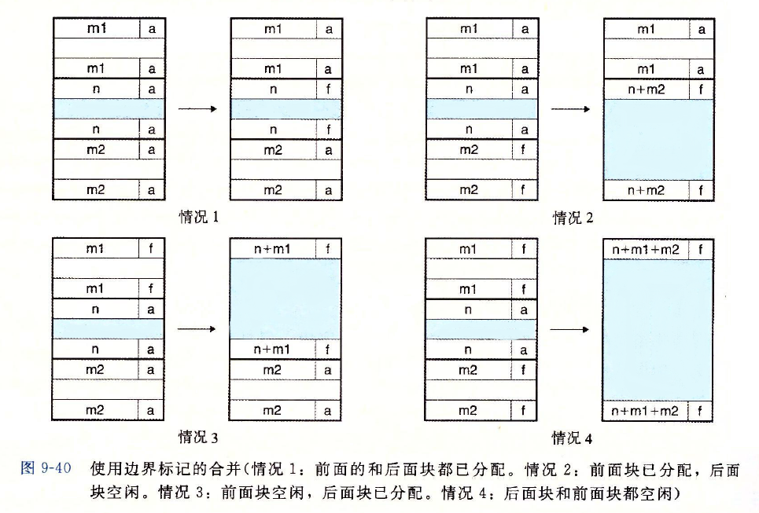
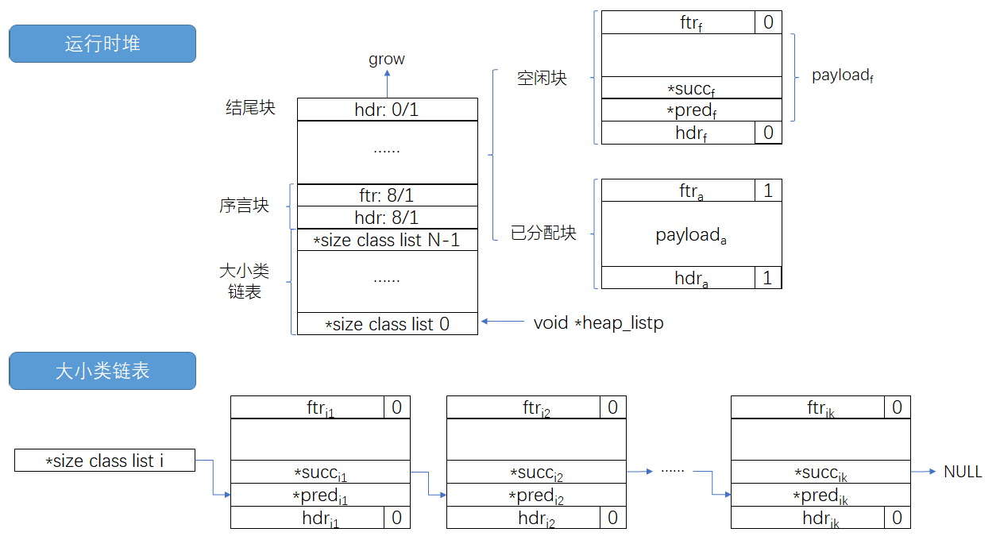

# Report of Malloc Lab

张奕朗 16307130242


### 版本一：简单的分配器

提供的代码中实现了一个最简单的分配器：

- `mm_init()`把堆组织成一个大的字节数组，用一个指针`p`来标注当前位置，初始指向数组的第一个字节；
- 调用`mm_malloc()`简单地将`p`增加`size`字节，并返回`p`的旧值；
- 调用`free()`什么都不做，直接返回调用函数；
- `mm_realloc()`在空间不够时直接申请新的空间，将旧的内容拷贝过去。

下面对未经过任何改动的代码直接进行编译测试：

```shell
Results for mm malloc:
trace  valid  util     ops      secs  Kops
 0       yes   23%    5694  0.000109 52239
 1       yes   19%    5848  0.000106 55066
 2       yes   30%    6648  0.000120 55585
 3       yes   40%    5380  0.000080 67419
 4        no     -       -         -     -
 5        no     -       -         -     -
 6        no     -       -         -     -
 7       yes   55%   12000  0.000133 90158
 8       yes   51%   24000  0.000119201511
 9        no     -       -         -     -
10        no     -       -         -     -
Total            -       -         -     -

Terminated with 5 errors
```

这个版本的分配器有以下几个需要改进的地方：

- `mm_init()`对堆的组织和标记过于简单；
- 内存的利用率极为低下，`mm_malloc()`没有搜索堆前部`free()`释放的块，导致堆无限制地增长；
- 其中5个测试没有通过，需要加强对边界条件的检查和堆的保护；

针对这些问题，派生出了利用隐式空闲链表、首次适配和边界标记的第二个版本。


### 版本二：隐式空闲链表 + 首次适配 + 边界标记

第二个版本实现了书上$9.9.5\sim9.9.11$节给出的带边界标记的首次适配隐式空闲链表，代码部分参考了书上$9.9.12$节的内容。



- 块的组织形式为：`hdr`表示头部标记，用于记录当前块的总大小（包扩头尾标记）以及是否被占用；`ftr`表示尾部标记，内内容同头部标记；`payload`表示有效载荷，其中可能包含填充以满足对齐到双字的要求；全局指针`heap_listp`指向序言块尾部标记的位置；

- 字的大小、双字的大小、申请内存片的大小均由宏定义给出；除此之外，几乎所有指针操作均由宏定义完成，包括生成头/尾标记、读写数据、获取块的大小和是否被占用信息、获得头/尾标记、计算前/后块的地址；

- `mm_init()`用双边界标记将堆的头部初始化为8字节已占用的序言块，尾部初始化为0字节已占用的结尾块，以方便边界条件的处理；头部前面还需要填入一个字大小的零（alignment padding），以满足每个块有效载荷双字对齐的要求；初始堆为空时需要调用`extend_heap()`申请`CHUNKSIZE`大小的空间；

- `extend_heap()`调用`mem_sbrk`申请新的空间来完成堆的增长，并且在扩展堆时满足对齐到双字的要求，扩展成功后为新的空闲块初始化头部和尾部边界标记，将其加入隐式空闲链表的尾部，最后调用`coalesce()`检查是否需要与前面的空闲块进行合并；

- `mm_free()`简单地将被释放块的边界标记中的占用位标记为0，并调用`coalesce()`检查是否需要合并空闲块；

- `coalesce()`根据下面四种情况进行空闲块的合并：

  

- `mm_malloc()`函数先将传入的`size`向上对齐到双字，并留出边界标记所需的空间，接着调用`find_fit()`函数在隐式空闲链表中寻找合适的块，若有则调用`place()`占用空闲块，否则调用`extend_heap()`扩展堆之后占用空闲块；

- `find_fit()`函数根据边界标记从头到尾遍历寻找合适的块，采用首次适配（first fit）来降低时间复杂度。

- `place()`函数计算放置块之后剩余部分的大小，若大于双字（即最小块的大小）则进行分割，并为分割后的块设置边界标记。

下面对版本二的代码进行测试（`mm_realloc()`未进行改动）：

```shell
Results for mm malloc:
trace  valid  util     ops      secs  Kops
 0       yes   99%    5694  0.010685   533
 1       yes   99%    5848  0.007456   784
 2       yes   99%    6648  0.010931   608
 3       yes  100%    5380  0.006134   877
 4       yes   66%   14400  0.000119120907
 5       yes   92%    4800  0.003744  1282
 6       yes   92%    4800  0.003637  1320
 7       yes   55%   12000  0.146443    82
 8       yes   51%   24000  0.257518    93
 9        no     -       -         -     -
10        no     -       -         -     -
Total            -       -         -     -
```

该版本堆空间的利用率已显著高于初始版本，但是还是存在几个问题：

- 隐式空闲链表每次搜索需要的时间复杂度为$O(n_f+n_a)$，其中$n_f$为空闲块的数量，$n_a$为已分配块的数量，将隐式空闲链表改为显式可以解决这个问题；
- 首次适配找到的块的大小不一定合适，很多情况下需要进行分割，这样会产生很多的内部碎片；
- 未能充分利用空闲块中的存储空间；
- 由于分配方式引起的外部碎片。

对前两个问题进行改善，从而有了接下来的版本三。


### 版本三：显式分离空闲链表 + 分离适配 + 边界标记

版本三中实现了书上$9.9.13\sim9.9.14$所述的显式空闲链表、分离的空闲链表以及分离适配。**由于lab的要求里面说不能用任何全局复合结构，全局数组首先就被ban了，所以大小类链表只能保存在堆的头部，并且需要用一个全局指针`*heap_listp`记录其位置。**



- 运行时堆与大小类链表：

  堆的顶部放`SIZECLASS`（规定大小类链表个数的宏定义）个按2的幂划分的大小类链表，即，从size class list 0到N-1（此处N即为`SIZECLASS`）分别对应的块的大小集合为：
  $$
  \{1\}，\{2\}，\{3,4\}，\{5\sim8\}，\dots，\{2^{N-2}+1\sim2^{N-1}\}，\{2^{N-1}+1\sim\infty\}
  $$
  若选择`SIZECLASS`为偶数，则大小类链表与序言块之间还需要一个字的填充（alignment padding），以满足有效载荷的双字对齐需求；若选择`SIZECLASS`为奇数则不需要填充。为了兼顾时间复杂度与空间复杂度，代码中的实现采用了`#define SIZECLASS 15`。

  空闲块中在靠近头部标记的位置处存入了前驱指针`*pred`和后继指针`*succ`，每个空闲块通过这两个指针连接成大小类链表，每个大小类链表中的空闲块按照大小升序排序；

  *注：由于在块空闲时前驱和后继指针分别占用一个字，被分配后清除，故最小块的大小仍为双字。*

- `mm_init()`：除了完成版本二中的功能外，还需要初始化大小类链表，让每个链表初始时指向`NULL`；

- `extend_heap()`：优化了函数调用的形式，直接传入需要拓展堆的大小`size`，而不是传入需要拓展多少个字，允许非整数字的扩展（仍然会对齐到双字）；

- `coalesce()`：基本过程同上个版本，对于后三种情况，需要调用`remove_list()`从大小类链表中删除大小发生变化的块，四种情况地最后都需要调用`insert_list()`将合并后的块插入到大小类链表中去；

- `remove_list()`与`insert_list()`：前者给定块指针，将块指针从分离空闲链表中去掉；后者给定块指针和块大小（其实也可以不给块大小，这里为了方便直接传参传进来了），将块插入到合适的链表中合适的位置（链表从小到大排列）。两者的操作较为相似，都需要根据大小确定大小类链表的标号（这一步通过循环移位完成），然后计算大小类链表的起始地址`heap_listp + class_idx * WSIZE`，最后遍历从头到尾访问该大小类链表找到删除/插入位置。需要分为四种情况：1）中部删除/插入；2）头部删除/插入；3）尾部删除/插入；4）只剩一个表元的删除/空链表插入。我的代码中对其公共部分作了code motion来提高速度；

- `mm_malloc()`：基本过程同上个版本，做了以下改动：优化双字对齐操作；调用`find_fit()`在分离空闲链表中寻找合适的块；用`place()`的返回值作为申请空间成功时的返回值；

- `find_fit()`：利用分离适配找到对应的大小类链表，在链表中做首次适配找寻合适大小的块，若没有合适大小的块则返回`NULL`；

- `mm_free()`：同上个版本，需要注意的是虽然`mm_free()`没有显式地调用`insert_list()`，但实际上这一步操作在调用`coalesce`地过程中间接地完成了；

- `mm_realloc()`：最主要的一点是检查旁边的块是不是空闲的，如果是空闲的，并且旁边块的大小加上当前块的大小比需要的新的空间大，那么进行块的合并，并且将合并后的块作为新的空间，否则申请新的空间。

测试结果如下：

```shell
Results for mm malloc:
trace  valid  util     ops      secs  Kops
 0       yes   97%    5694  0.000740  7690
 1       yes   97%    5848  0.000617  9480
 2       yes   98%    6648  0.000684  9724
 3       yes   99%    5380  0.000508 10588
 4       yes   66%   14400  0.000900 15993
 5       yes   92%    4800  0.000447 10741
 6       yes   89%    4800  0.000415 11577
 7       yes   61%   12000  0.000549 21842
 8       yes   53%   24000  0.003824  6276
 9       yes   99%   14401  0.000255 56519
10       yes   86%   14401  0.000241 59656
Total          85%  112372  0.009181 12240

Perf index = 51 (util) + 40 (thru) = 91/100
```

总的来说效果还是挺好的，不过第7个和第8个测试得分较低，用gdb调试后发现是由于交替申请大空间和小空间造成了过多的外部碎片，这也同样是版本二中出现的问题之一。

在网上查找资料后找到了一种减少外部碎片的“歪路子”，于是便有了下面的版本四。


### 版本四：显式分离空闲链表 + 分离适配 + 边界标记 + 外部碎片优化

其实版本四和版本三之间只有一个函数的区别：`place()`。

如果每次allocate的块按照小块和大块交替的顺序的话，`place()`会拆分出一些碎片化的块，但如果程序只释放了大块而没有释放小块，那么我们虽然有很多大的块，但是它们被很多个没有释放的小块隔开了，虽然我们剩余的总空间十分充足，但是申请一个更大的块的时候就需要`extend_heap()`了，这就是分配方式造成的外部碎片。

其中一个改进的办法就是设定一个阈值（这里是96）：执行拆分时，当需要`place()`的空间小于这个阈值的时候把后面的块拆分出来，大于阈值时把前面的块拆分出来。如果设定的阈值刚好位于申请的大块的尺寸和申请的小块的尺寸之间的话，前后两个拆分出来的块就可以进行`coalesce()`，减少外部碎片。

（不过这个阈值设成多少是个玄学问题，写lab的时候当然是面向testcase优化，手动滑稽。）

```C
/*
 * place - Place asize into bp, split the block if neccessary.
 */
static void* place(void *bp, size_t asize)
{
	size_t csize = GET_SIZE(HDRP(bp)), remain = csize - asize;

	remove_list(bp);

	if (remain < (2 * DSIZE)) {
		PUT(HDRP(bp), PACK(csize, 1));
		PUT(FTRP(bp), PACK(csize, 1));
	}
	else if(asize < 96) {
		PUT(HDRP(bp), PACK(asize, 1));
		PUT(FTRP(bp), PACK(asize, 1));
		PUT(HDRP(NEXT_BLKP(bp)), PACK(remain, 0));
		PUT(FTRP(NEXT_BLKP(bp)), PACK(remain, 0));
		insert_list(NEXT_BLKP(bp), remain);
	}
	else {
		PUT(HDRP(bp), PACK(remain, 0));
		PUT(FTRP(bp), PACK(remain, 0));
		insert_list(bp, remain);
		bp = NEXT_BLKP(bp);
		PUT(HDRP(bp), PACK(asize, 1));
		PUT(FTRP(bp), PACK(asize, 1));
	}
	return bp;
}
```

下面给出最终的测试结果：

```shell
Results for mm malloc:
trace  valid  util     ops      secs  Kops
 0       yes   97%    5694  0.000763  7465
 1       yes   97%    5848  0.000671  8717
 2       yes   98%    6648  0.000702  9469
 3       yes   99%    5380  0.000528 10180
 4       yes   66%   14400  0.000927 15537
 5       yes   92%    4800  0.000447 10738
 6       yes   89%    4800  0.000425 11305
 7       yes   95%   12000  0.000535 22442
 8       yes   88%   24000  0.003095  7755
 9       yes   99%   14401  0.000258 55796
10       yes   86%   14401  0.000242 59582
Total          91%  112372  0.008592 13079

Perf index = 55 (util) + 40 (thru) = 95/100
```

可以看到外部碎片显著减少，空间利用率得到提升，最后拿到了95分。

最后的最后再和libc库比较一下：

```shell
Results for libc malloc:
trace  valid  util     ops      secs  Kops
 0       yes    0%    5694  0.001660  3430
 1       yes    0%    5848  0.001313  4454
 2       yes    0%    6648  0.001852  3590
 3       yes    0%    5380  0.001674  3215
 4       yes    0%   14400  0.000519 27740
 5       yes    0%    4800  0.002310  2078
 6       yes    0%    4800  0.002008  2390
 7       yes    0%   12000  0.000970 12371
 8       yes    0%   24000  0.000992 24191
 9       yes    0%   14401  0.000509 28276
10       yes    0%   14401  0.000278 51746
Total           0%  112372  0.014085  7978
```

可以看到我的代码速度更快，但是内存利用率略低于标准C库，或许libc在外部碎片上还进行了更多的优化吧。